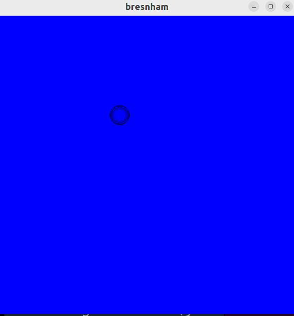

# WaterDrop-using-opengl
This project of WaterDrop animation using opengl in c language

use gcc filename.c -lglut -lGLU -lGL -lm   command to compile the code 

use ./a.out to execute the code

# Images

# click anywhere and drop starts falling toward that point

# Drop reaches that point and one waves starts forming 

# After some time one more wave forms

